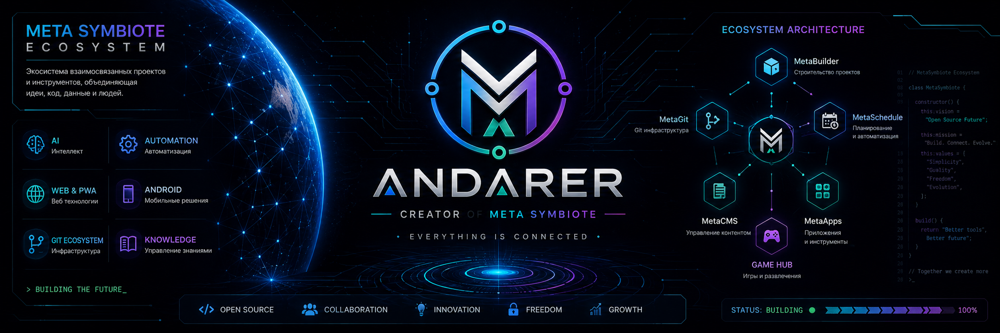
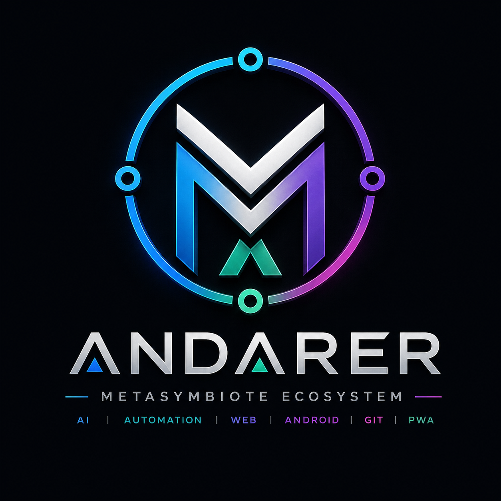
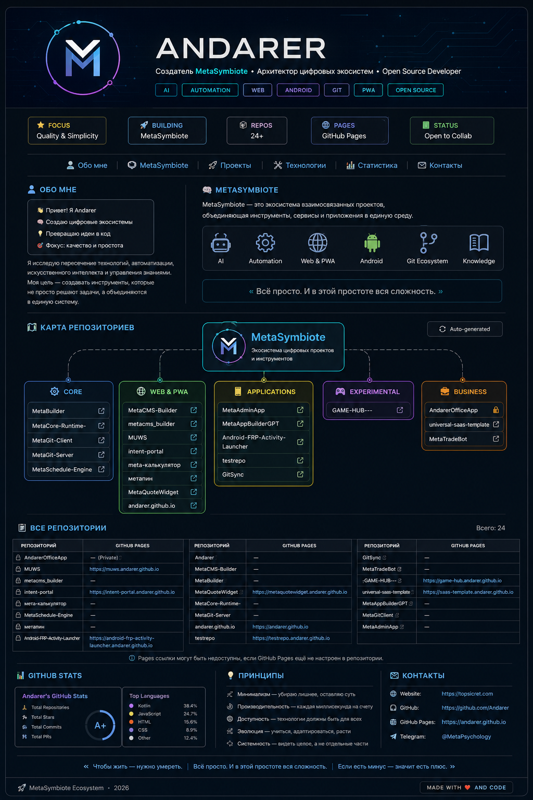

  

<h1 align="center">⚡ ANDARER</h1>

  

<b>Creator of MetaSymbiote</b> 
AI • Automation • Web • Android • Git • PWA

---

👋 About

Привет.

Я — Andarer, создатель MetaSymbiote.

Исследую пересечение:

- 🤖 Искусственного интеллекта
- ⚙️ Автоматизации
- 🌐 Web и PWA
- 📱 Android
- 🔗 Git-инфраструктуры
- 📚 Управления знаниями

Моя цель — создавать инструменты, которые работают вместе как единый организм.

---

🌌 MetaSymbiote

MetaSymbiote
│
├── MetaBuilder
├── MetaGit
├── MetaSchedule
├── MetaCMS
├── MetaApps
├── GAME HUB
└── Future Projects

«Всё просто. И в этой простоте вся сложность.»

  

---

🚀 Core Projects

Project| Description
MetaBuilder| Конструктор цифровых проектов
MetaCore Runtime| Ядро экосистемы
MetaGit Client| Git-инструменты
MetaGit Server| Git-инфраструктура
MetaSchedule Engine| Планирование и автоматизация
MetaCMS Builder| Управление контентом
MetaAdminApp| Панель управления
GAME HUB| Игровая платформа
MetaTradeBot| Торговая автоматизация

---

🛠️ Technology Stack

Mobile

"Android" (https://img.shields.io/badge/Android-3DDC84?logo=android&logoColor=white)
"Kotlin" (https://img.shields.io/badge/Kotlin-7F52FF?logo=kotlin&logoColor=white)

Web

"HTML5" (https://img.shields.io/badge/HTML5-E34F26?logo=html5&logoColor=white)
"CSS3" (https://img.shields.io/badge/CSS3-1572B6?logo=css3&logoColor=white)
"JavaScript" (https://img.shields.io/badge/JavaScript-F7DF1E?logo=javascript&logoColor=black)

Infrastructure

"Git" (https://img.shields.io/badge/Git-F05032?logo=git&logoColor=white)
"Docker" (https://img.shields.io/badge/Docker-2496ED?logo=docker&logoColor=white)
"Linux" (https://img.shields.io/badge/Linux-FCC624?logo=linux&logoColor=black)

---

📊 GitHub Analytics

---

🌍 Ecosystem Links

Resource| Link
GitHub| https://github.com/Andarer
GitHub Pages| https://andarer.github.io
TopSicret| https://topsicret.com
MetaSymbiote Portal| In Development

---

📜 Philosophy

«Чтобы жить — нужно умереть.»

«Всё просто. И в этой простоте вся сложность.»

«Если есть минус — значит есть плюс.»

---

🚧 Current Focus

- MetaBuilder
- MetaSchedule Engine
- MetaGit Client
- MetaGit Server
- MetaCMS Builder
- GAME HUB
- MetaSymbiote Portal

---

⚡ MetaSymbiote Ecosystem

2026

Сделано с ❤️ и кодом

